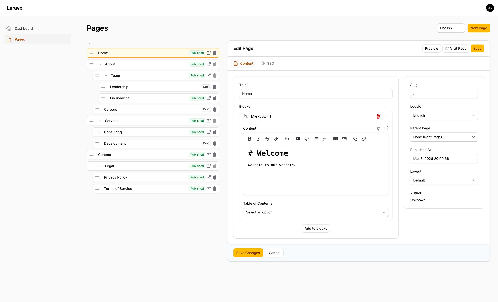
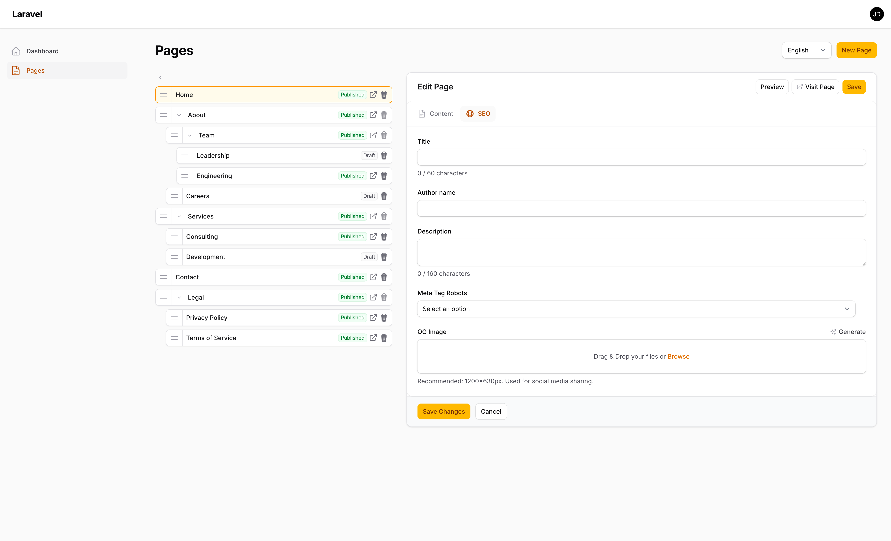

# Filament Pages

[](https://packagist.org/packages/bambamboole/filament-pages)
[](https://github.com/bambamboole/filament-pages/actions?query=workflow%3Arun-tests+branch%3Amain)
[](https://packagist.org/packages/bambamboole/filament-pages)

A Filament plugin for managing hierarchical, block-based content pages. Features a drag-and-drop page tree, extensible block system (Markdown, Image out of the box), nested pages with automatic slug path computation, multi-locale support, SEO integration, and live preview.

## Features

- **Page Tree** — Interactive drag-and-drop tree for reordering and nesting pages
- **Block Builder** — Flexible content composition with an extensible block system
- **Markdown Block** — Rich editor with table of contents, heading permalinks, GFM support, and optional Torchlight syntax highlighting
- **Image Block** — Spatie Media Library integration with responsive images and an image editor
- **Custom Blocks & Layouts** — Artisan generators for scaffolding your own blocks and layouts
- **Multi-Locale** — Locale-scoped page trees with automatic route prefixing and browser language detection
- **SEO** — Built-in SEO metadata tab with extensible fields and optional OG image generation via Browsershot
- **Live Preview** — Instant page preview powered by Filament Peek
- **Publishing Workflow** — Draft, published, and scheduled states with `published_at` datetime
- **Authorization** — Laravel policy support for `create`, `update`, `delete`, and `reorder` abilities
- **Frontend Routing** — Catch-all route registration that resolves pages by slug path and locale
- **Hierarchical Slugs** — Automatic slug path computation based on the page tree hierarchy

## Screenshots

| Page Editor | SEO Tab |
|:-----------:|:-------:|
|  |  |

## Installation

```bash
composer require bambamboole/filament-pages
```

Publish and run the migrations:

```bash
php artisan vendor:publish --tag="filament-pages-migrations"
php artisan migrate
```

Optionally publish the config:

```bash
php artisan vendor:publish --tag="filament-pages-config"
```

Register the plugin in your Filament panel provider:

```php
use Bambamboole\FilamentPages\FilamentPagesPlugin;

public function panel(Panel $panel): Panel
{
    return $panel
        ->plugins([
            FilamentPagesPlugin::make(),
        ]);
}
```

Add the plugin views to your Tailwind CSS content paths:

```css
@source '../../../../vendor/bambamboole/filament-pages/resources/**/*.blade.php';
```

## Configuration

The plugin is configured through the fluent API on `FilamentPagesPlugin` and the published config file.

```php
FilamentPagesPlugin::make()
    ->seoForm(fn () => [
        TextInput::make('canonical_url'),
    ])
    ->treeItemActions(fn (ManagePages $page) => [
        Action::make('duplicate')->action(fn (array $arguments) => /* ... */),
    ])
    ->previewView('my-custom-preview-view')
```

Blocks and layouts are auto-discovered using PHP attributes. Add your application's directories to the discovery paths in `config/filament-pages.php`:

```php
// config/filament-pages.php
'block_discovery_paths' => [
    app_path('Blocks'),
],

'layout_discovery_paths' => [
    app_path('Layouts'),
],
```

### Blocks

Blocks are classes annotated with `#[IsBlock]` that extend `AbstractBlock`. They are auto-discovered from the package's built-in `Blocks/` directory and any directories listed in `block_discovery_paths`.

Two blocks ship out of the box:
- **MarkdownBlock** — Rich markdown editor with optional table of contents (top/left/right positioning), front matter parsing, and Torchlight syntax highlighting.
- **ImageBlock** — Spatie Media Library file upload with responsive images and an image editor.

### Layouts

Layouts control how pages render on the frontend. They are classes annotated with `#[IsLayout]` that extend `AbstractLayout`. They are auto-discovered from the package's built-in `Layouts/` directory and any directories listed in `layout_discovery_paths`.

### Multi-Locale

Enable multi-language content by configuring locales in the config file:

```php
// config/filament-pages.php
'routing' => [
    'prefix' => '',
    'locales' => ['en' => 'English', 'de' => 'Deutsch'],
],
```

When locales are enabled, the page tree filters by locale and frontend routes include a `{locale}` prefix.

### SEO

SEO is always enabled. Every page form includes an SEO tab (powered by `ralphjsmit/laravel-filament-seo`).

Extend the SEO form with custom fields:

```php
->seoForm(fn () => [
    TextInput::make('canonical_url'),
])
```

### Response Caching

Enable HTTP response caching for frontend pages using `spatie/laravel-responsecache`:

```php
// config/filament-pages.php
'cache' => [
    'enabled' => env('FILAMENT_PAGES_CACHE_ENABLED', false),
    'lifetime' => 60 * 60,   // 1 hour fresh
    'grace' => 60 * 15,      // 15 min stale-while-revalidate
],
```

When enabled, cached responses are served instantly and refreshed in the background after expiry. The cache is automatically invalidated when a page is saved or deleted.

### Preview

Live preview is always enabled (powered by `pboivin/filament-peek`). To use a custom preview view:

```php
->previewView('my-custom-preview-view')
```

## Creating Custom Blocks

Generate a block stub with the Artisan command:

```bash
php artisan filament-pages:make-block MyCustomBlock
```

A custom block uses the `#[IsBlock]` attribute for metadata, extends `AbstractBlock`, and defines a `build()` method to configure the Filament form schema:

```php
use Bambamboole\FilamentPages\Blocks\AbstractBlock;
use Bambamboole\FilamentPages\Blocks\IsBlock;
use Filament\Forms\Components\Builder\Block;
use Filament\Forms\Components\TextInput;

#[IsBlock(type: 'call-to-action', label: 'Call to Action')]
class CallToActionBlock extends AbstractBlock
{
    protected string $view = 'blocks.call-to-action';

    public function build(Block $block): Block
    {
        return $block->schema([
            TextInput::make('heading')->required(),
            TextInput::make('button_text')->required(),
            TextInput::make('button_url')->url()->required(),
        ]);
    }
}
```

The `#[IsBlock]` attribute accepts `type` (unique identifier matching the block type stored in the database), `label` (display name), and an optional `translateLabel` flag. If `label` is omitted, it is derived from the type automatically.

### Block Schema (Structured Data)

Blocks can contribute JSON-LD structured data by overriding the `registerSchema()` method. The page model collects schema entries from all blocks and passes them to the SEO layer automatically.

```php
use Bambamboole\FilamentPages\Blocks\AbstractBlock;
use Bambamboole\FilamentPages\Blocks\IsBlock;
use Bambamboole\FilamentPages\Models\Page;
use Filament\Forms\Components\Builder\Block;
use Filament\Forms\Components\Repeater;
use Filament\Forms\Components\TextInput;
use RalphJSmit\Laravel\SEO\SchemaCollection;

#[IsBlock(type: 'faq', label: 'FAQ')]
class FaqBlock extends AbstractBlock
{
    protected string $view = 'blocks.faq';

    public function build(Block $block): Block
    {
        return $block->schema([
            Repeater::make('questions')->schema([
                TextInput::make('question')->required(),
                TextInput::make('answer')->required(),
            ]),
        ]);
    }

    public function registerSchema(SchemaCollection $schema, array $data, Page $page): SchemaCollection
    {
        return $schema->addFaqPage(function ($faqSchema) use ($data) {
            foreach ($data['questions'] ?? [] as $item) {
                $faqSchema->addQuestion($item['question'], $item['answer']);
            }

            return $faqSchema;
        });
    }
}
```

The `SchemaCollection` supports `addFaqPage()`, `addArticle()`, and `addBreadcrumbs()` out of the box. Blocks that don't override `registerSchema()` contribute nothing — no empty `<script>` tags are generated.

### Block Assets

Blocks can declare CSS and JavaScript assets by overriding the `assets()` method. Assets are deduplicated per request and rendered via Blade directives in your layout.

```php
use Bambamboole\FilamentPages\Blocks\BlockAsset;

public function assets(): array
{
    return [
        'css' => [
            BlockAsset::url(asset('css/cta.css')),
            BlockAsset::inline('.cta { background: var(--primary); }'),
        ],
        'js' => [
            BlockAsset::url('https://cdn.example.com/lib.js'),
            BlockAsset::inline('console.log("CTA loaded");'),
        ],
    ];
}
```

`BlockAsset::url()` creates a `<link>`/`<script src>` tag while `BlockAsset::inline()` creates an inline `<style>`/`<script>` tag. CSP nonces are applied automatically when `Vite::cspNonce()` is set.

Include the Blade directives in your layout to render block assets:

```blade
<head>
    @filamentPagesStyles
    @filamentPagesBlockStyles
</head>
<body>
    {!! $page->renderBlocks() !!}

    @filamentPagesBlockScripts
</body>
```

Blocks that don't override `assets()` contribute nothing.

## Creating Custom Layouts

Generate a layout stub:

```bash
php artisan filament-pages:make-layout LandingPage
```

A layout uses the `#[IsLayout]` attribute for metadata, extends `AbstractLayout`, and provides a `render()` method:

```php
use Bambamboole\FilamentPages\Layouts\AbstractLayout;
use Bambamboole\FilamentPages\Layouts\IsLayout;
use Bambamboole\FilamentPages\Models\Page;
use Illuminate\Http\Request;
use Illuminate\View\View;

#[IsLayout(key: 'landing-page', label: 'Landing Page')]
class LandingPageLayout extends AbstractLayout
{
    protected string $view = 'layouts.landing-page';

    public function render(Request $request, Page $page): View
    {
        return view($this->view, ['page' => $page]);
    }
}
```

The `#[IsLayout]` attribute accepts `key` (unique identifier used in the database), `label` (display name), and an optional `translateLabel` flag. If `label` is omitted, it is derived from the key automatically.

Include the asset directives in your layout to load the frontend CSS and any block-specific assets:

```blade
<head>
    @filamentPagesStyles
    @filamentPagesBlockStyles
</head>
<body>
    {!! $page->renderBlocks() !!}

    @filamentPagesBlockScripts
</body>
```

## Route Registration

Register the frontend page routes in your `routes/web.php`:

```php
use Bambamboole\FilamentPages\Facades\FilamentPages;

FilamentPages::routes();
```


When locales are configured, routes are automatically prefixed with `{locale}`.

## Frontend Rendering

Pages are rendered through their assigned layout using `{!! $page->renderBlocks() !!}`.

You can also render blocks programmatically:

```php
$page = Page::where('slug_path', '/about')->first();
echo $page->renderBlocks();
```

## Import & Export

Pages can be exported to and imported from YAML files. Both commands are idempotent — running them multiple times produces the same result.

### Export

```bash
php artisan filament-pages:export --path=resources/pages --locale=en --type=page
```

Exports pages as YAML files in a hierarchical directory structure. Media files are exported alongside their page. Parent pages with children use `_index.yaml`, and filenames are prefixed with their sort order (e.g. `01-about/`).

### Import

```bash
php artisan filament-pages:import --path=resources/pages --locale=en --type=page --prune --dry-run
```

| Option | Description |
|--------|-------------|
| `--path` | Source directory (default: `resources/pages`) |
| `--locale` | Locale for imported pages |
| `--type` | Page type (default: `page`) |
| `--prune` | Soft-delete database pages not found in source |
| `--dry-run` | Preview changes without modifying the database |

The importer creates, updates, or skips pages based on whether changes are detected. Soft-deleted pages are restored if they reappear in the source files. Media referenced in YAML blocks are imported automatically.

## Page Tree

The plugin provides an interactive page tree at `/pages` in your Filament panel. You can:
- Drag and drop to reorder and nest pages
- Create, edit, and delete pages via slide-over modals
- Publish/unpublish with datetime scheduling
- Switch between locales
- Preview pages before publishing

Custom actions can be added to tree items:

```php
FilamentPagesPlugin::make()
    ->treeItemActions(fn (ManagePages $page) => [
        Action::make('duplicate')->action(fn (array $arguments) => /* ... */),
    ])
```

## Authorization

The package supports Laravel policies for access control. Create a policy for your page model to restrict actions:

```bash
php artisan make:policy PagePolicy --model=Page
```

Supported abilities: `create`, `update`, `delete`, `reorder`.

The package is **permissive by default** — when no policy is registered, all actions are allowed. Once a policy exists, only explicitly allowed abilities are permitted.

## Testing

```bash
composer test
```

## Changelog

Please see [CHANGELOG](CHANGELOG.md) for more information on what has changed recently.

## Credits

- [Manuel Christlieb](https://github.com/bambamboole)
- [All Contributors](../../contributors)

## License

The MIT License (MIT). Please see [License File](LICENSE.md) for more information.
